<h1 align="center">
    Meus Projetos Curso React com Redux - My Projects Course React with Redux
</h1>

 

  

 

# 💻  Projetos

## Components

### Description

#### Use of components into componentes, [Faker](https://github.com/marak/Faker.js/) library, [Semantic](https://semantic-ui.com/) for styles, props, function components - all using typescript. 

    

## Seasons

### Description

#### Get users physical location, determine the current month, change text and styling based on location and month, class components, geolocation API, conditional rendering, loading spinner, config best practice, default props - all using typescript. 

  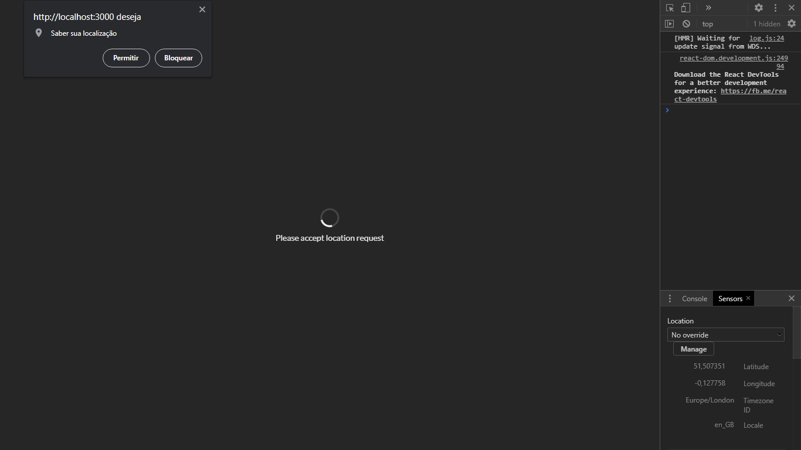  
  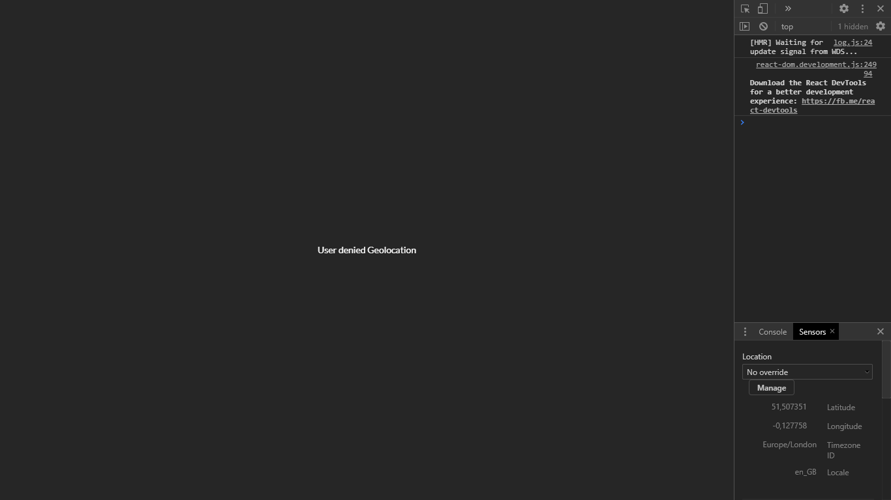 
  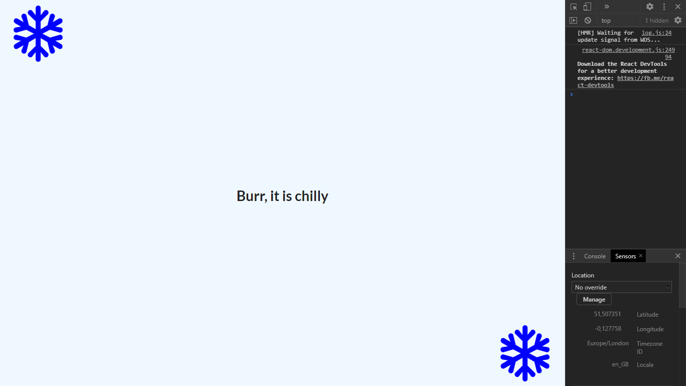 
  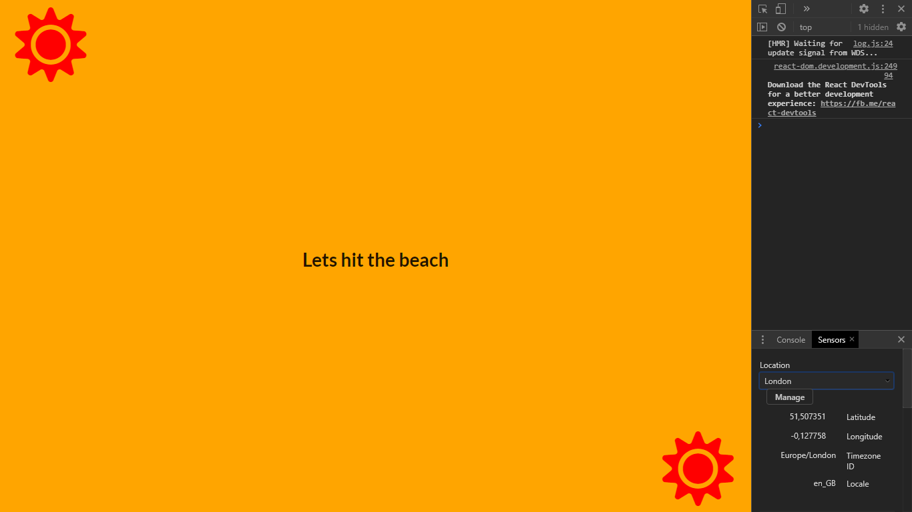 

## Pics

### Description

#### Get feedback from the user, fetch data from some outside API or server, show list of records, get a search term from user, use that term to make a request to an API, take the feched images and show them on the screen in a list, structure components folder, Controlled element, get info from DOM Elements, key for root element when rendering a list - all using typescript. 

  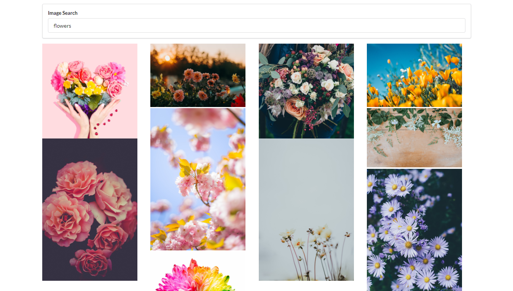  
  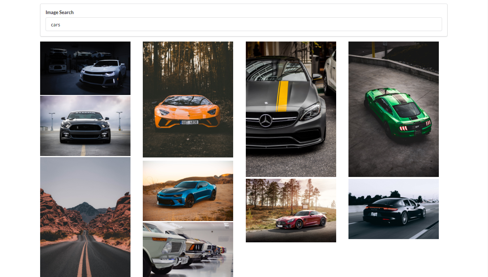   

## Videos

### Description

#### Review of all learned till now, youtube public API - all using typescript. 

  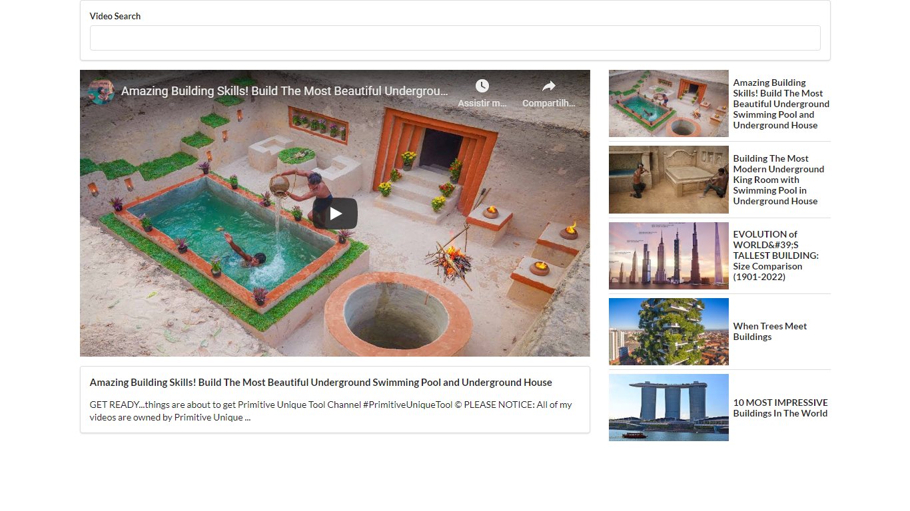  
  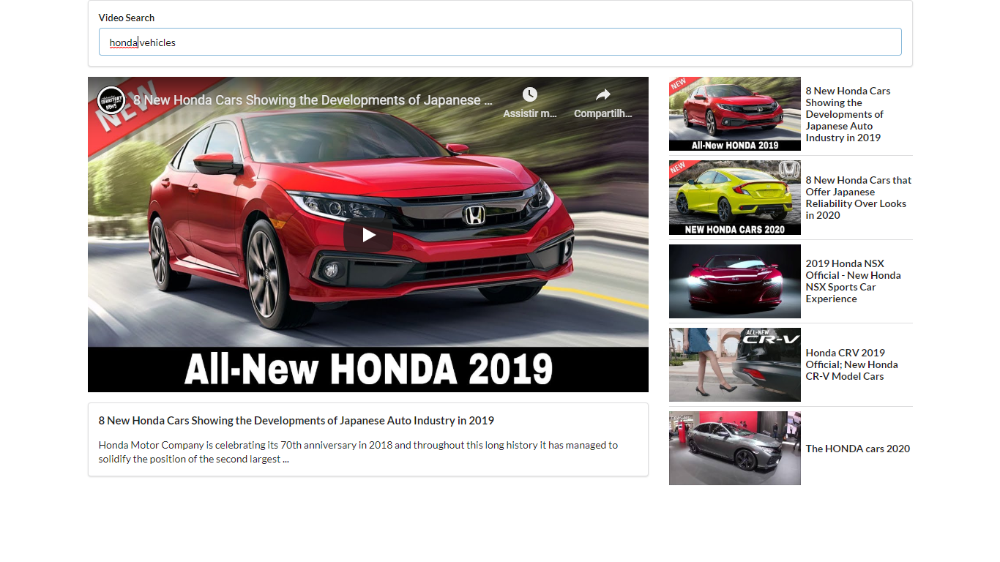 
  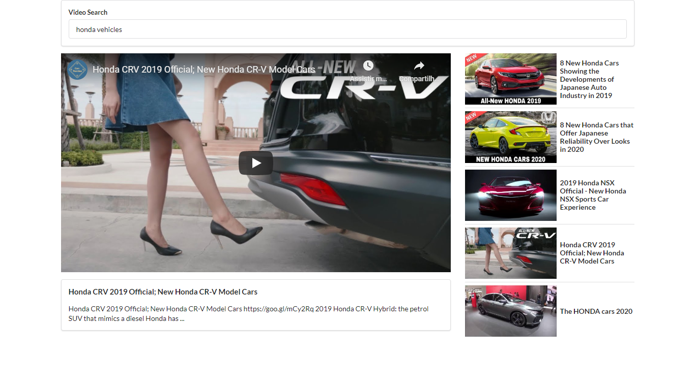  
  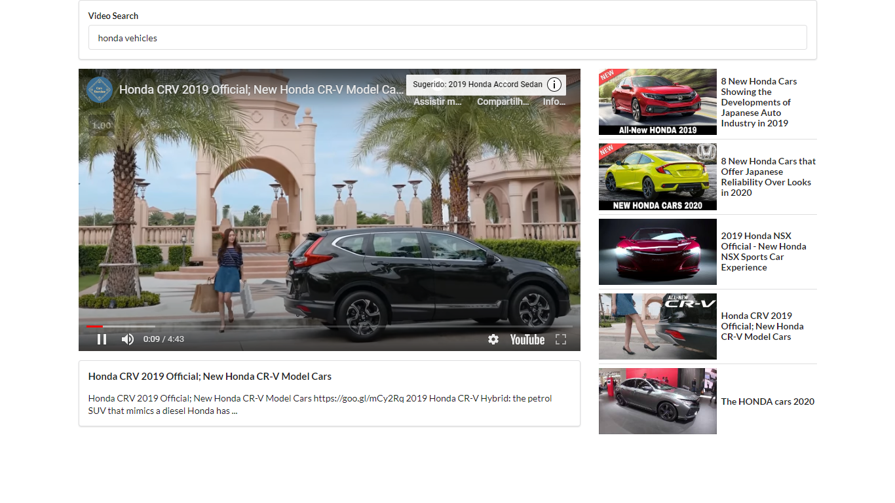
  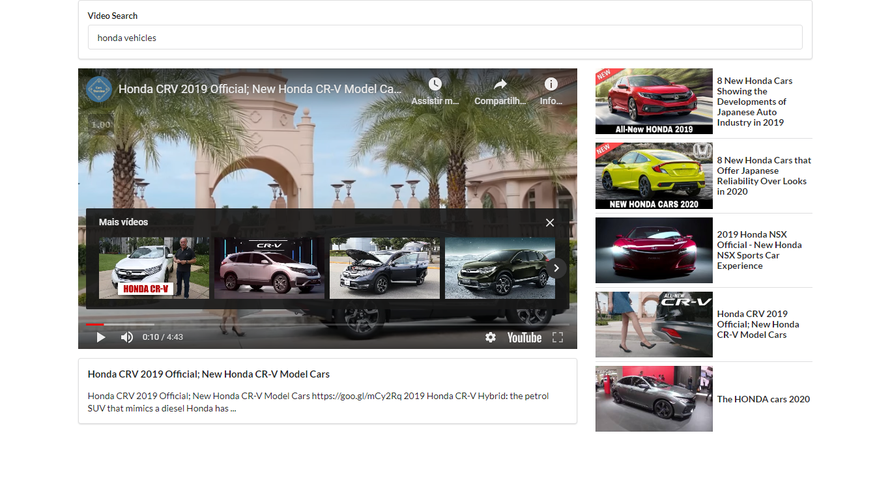     

## Songs

### Description

#### Use redux to manage react state using react-redux library, modify and access states  - all using typescript. 

    
   
    
  
       

## 🚀  Tecnologias

Esse projeto foi desenvolvido com as seguintes tecnologias:

- [Node.js](https://nodejs.org/en/)
- [TypeScript](https://www.typescriptlang.org/)
- [React](https://reactjs.org)
- [Redux](https://redux.js.org/)

## :memo: Licença

Esse projeto está sob a licença MIT. Veja o arquivo [LICENSE](LICENSE.md) para mais detalhes.

---

