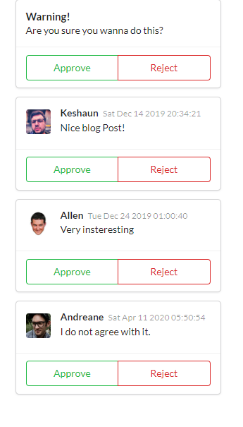

<h1 align="center">
    Meus Projetos Curso React com Redux - My Projects Course React with Redux
</h1>

 

  

 

# 💻  Projetos

## Components

### Description

#### Use of components into componentes, faker library, [semantic](https://semantic-ui.com/) for styles, props all using typescript. 

  
  

## 🚀  Tecnologias

Esse projeto foi desenvolvido com as seguintes tecnologias:

- [Node.js](https://nodejs.org/en/)
- [React](https://reactjs.org)

## :memo: Licença

Esse projeto está sob a licença MIT. Veja o arquivo [LICENSE](LICENSE.md) para mais detalhes.

---

